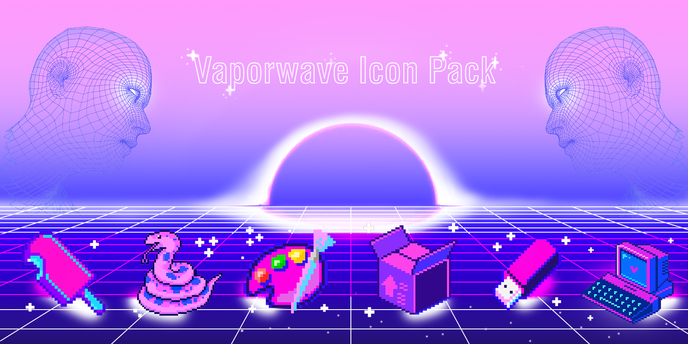

<div align="center">

# 🎨 Vaporwave Icon Pack


> *Neon nostalgia for your desktop — free & open source vaporwave icon pack.*

</div>

---
---

*Icon pack in vaporwave aesthetic (neon 80s/90s, ICO + PNG, CC BY 4.0 license) + wallpapers (2560 x 1600) — designed for desktop customization, docks, and app shortcuts.*

Formats: **ICO + PNG (256–512px)**

License: **[CC BY 4.0](https://creativecommons.org/licenses/by/4.0/)**

---

## 🌈 Preview



*(Preview image — vaporwave neon gradient, pink–blue tones, 80s retro-futurist style)*

---

## 📦 Folder structure

```
vaporwave-icons/
├── ico/           → for Windows shortcuts and folders
├── png/           → for docks, launchers, and themes
├── preview/       → example grids and wallpapers
└── LICENSE
```

---

## 🧠 Description

This icon pack was created as a personal vaporwave-inspired design project, blending **neon gradients**, **retro grid motifs**, and **futurist minimalism**.

Each icon was designed to maintain visual balance and readability across different desktop environments, from Windows to macOS docks or Linux launchers.

**Palette:**
| Color | Hex |
|-------|------|
| 🩷 Pink | `#FF9BFD` |
| 💜 Purple | `#D399FF` |
| 💙 Cyan | `#5DD6FF` |
| 🔵 Deep Blue | `#230F6F` |
| 🟣 Violet | `#380FFA` |

---

## 🖼️ Wallpapers

Wallpapers are available separately (2560×1600px).

👉 **[Download wallpapers here ↗](https://your-link-here.com)**

*(Replace with your Drive / Itch.io / Gumroad link.)*

---

## 🔗 Download

📦 **[Download ZIP (GitHub) ↗](https://github.com/guilherme-giuliette/vaporwave-icons/archive/refs/heads/main.zip)**

* Clone the repo:

  ```
  git clone https://github.com/guilherme-giuliette/vaporwave-icons.git
  ```

---

## 💬 Credits & License

This project is shared under the **Creative Commons Attribution 4.0 International License (CC BY 4.0)**.
You are free to:

* Use, share, and modify the icons for **personal and commercial purposes**
* Credit the author when redistributing or showcasing the work

**Attribution example:**
Icons by *Guilherme Giuliette* — [GitHub](https://github.com/guilherme-giuliette/vaporwave-icons)

---

## ❤️ Feedback & Contributions

If you enjoy this pack or use it in your setup, feel free to:

* ⭐ Star this repository on GitHub
* 💬 Share screenshots or feedback in the future Reddit thread
* 🧠 Suggest new icons or report issues via **GitHub Issues**: [https://github.com/guilherme-giuliette/vaporwave-icons/issues](https://github.com/guilherme-giuliette/vaporwave-icons/issues)

---

> *“Retrofuturism meets desktop customization — enjoy the vibe!”*  
> — **Guilherme Giuliette** / [**@kleberTM**](https://github.com/guilherme-giuliette)

---

<p align="center">
  <sub>Designed with 💜 by <a href="https://github.com/guilherme-giuliette"><b>Guilherme Giuliette</b></a> — kleberTM</sub>
</p>


